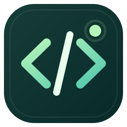
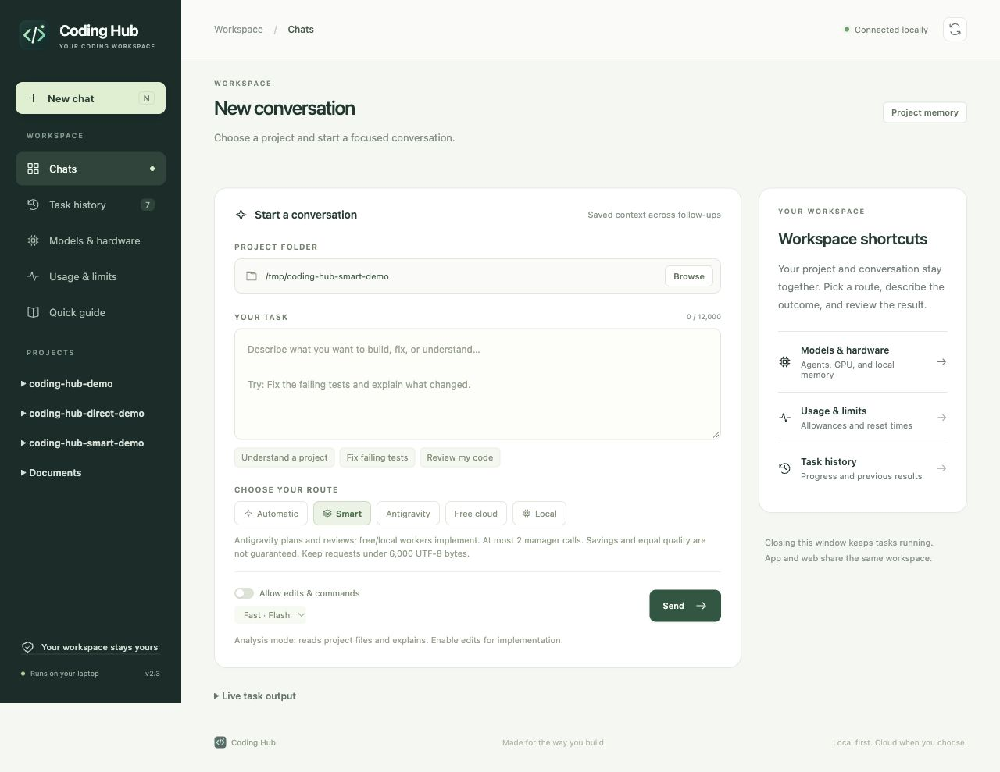
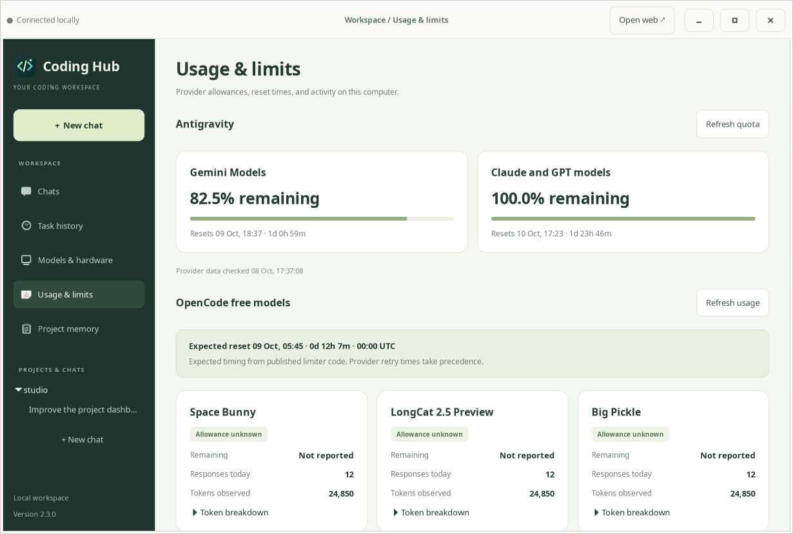
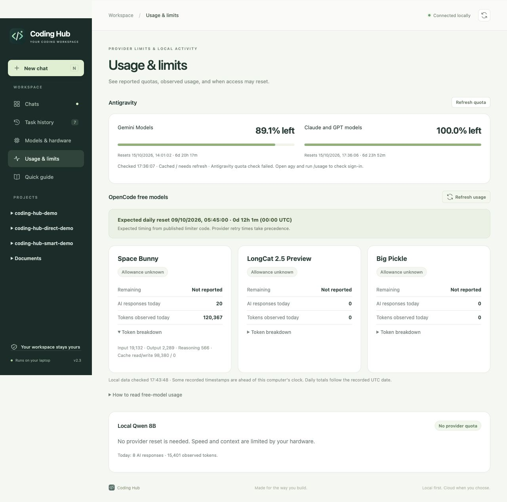

<p align="center"></p>
<h1 align="center">Coding Hub</h1>
<p align="center">A calm workspace for cloud coding agents and local Qwen.</p>

Coding Hub brings Antigravity, verified free OpenCode models, and Ollama into one workspace with **terminal, native Linux app, and web interfaces**. Choose a project, describe a task, and follow its progress. Keep inference local when you want to, or use a cloud agent for larger work.



The native Linux app uses the same workspace organization, with dedicated pages for **Chats**, **Task history**, **Models & hardware**, **Usage & limits**, and **Project memory**. Provider limits are grouped into cards, token breakdowns expand when needed, and project chats remain available in the sidebar.



*Native GTK layout preview with synthetic usage data. Actual values come from your providers and local history.*

## What you get

- Project → chat navigation in the native app and browser, with saved messages, follow-up replies, earlier-message loading, live output, cancellation, and draft recovery.
- Persistent project instructions, pinned requirements, searchable conversation checkpoints, and a local source index for focused context.
- A Usage & limits page: live Antigravity quotas, free-model local usage and observed retry times, expected daily reset countdowns, and local Qwen status.
- Opt-in Smart routing: Antigravity makes a short plan and reviews evidence; verified free models or local Qwen perform the work, with measured manager token usage and at most two manager calls.
- Automatic fallback: Antigravity → currently verified free OpenCode models → local Qwen3 8B. A handoff preserves the original task and partial changes.
- NVIDIA status, actual model offload, memory usage, and a button to release the local model from memory.
- A lightweight Python standard-library backend and plain HTML/CSS/JavaScript. The CLI and web version need no third-party Python packages or npm build.
- A native Linux app window using GTK 4, with its own icon, plus a terminal menu and command-line interface.

## Install

Requires Python 3.10 or later. Linux is the primary desktop target; the dashboard and terminal coordinator also run on macOS. Windows has a basic launcher, but full agent integration is not validated there.

The standalone Linux app additionally needs PyGObject and GTK 4. On Ubuntu 24.04 or later, if these are missing:

```bash
sudo apt install python3-gi gir1.2-gtk-4.0
```

Use the system `python3` so it can find these distribution packages. The CLI and web interfaces work without them.

Install the native agents you want to use:

1. [OpenCode](https://opencode.ai/docs/)
2. [Ollama](https://ollama.com/download)
3. [Antigravity CLI](https://antigravity.google/docs/cli/install/) for Google's native account access

```bash
git clone https://github.com/prabinadkri/coding-hub.git
cd coding-hub
python3 setup.py --local
```

Setup downloads Qwen3 8B (about 5.2 GB), creates the `coding-hub-qwen:8b` alias without duplicating its weights, and adds a Linux application launcher. Existing models are preserved. To install the launcher without downloading a model, run `python3 setup.py`.

Run `agy` in a terminal and complete your own Google sign-in. The coordinator calls Google's native CLI; it does not extract or proxy account tokens.

## Use

Choose the interface you prefer:

```bash
codehub       # Terminal menu
codehub app   # Standalone Linux application
codehub web   # Dashboard in your browser
```

If `codehub` is not on your PATH, use `~/.local/bin/codehub` instead. On Linux, **Coding Hub** in the Applications menu and `Coding Hub.sh` open the standalone app. The app icon's context menu also offers the browser and terminal. On macOS, `Coding Hub.command` opens the browser interface.

Choose a project folder and enter your task. Analysis mode is the default. Enable **Allow edits & commands** for implementation. **Fast** selects Flash for Antigravity; **Deep** selects Pro. Free cloud and local routes use their own configured models.

The app and browser share one background server and task history; reopening the app raises its existing window. The terminal uses the same routing engine, models, project memory, and saved conversations. CLI chats appear under their project in the app and browser; native CLI run logs remain separate from dashboard task activity.

The server listens only on `127.0.0.1`, and its APIs require a per-session token. The launch URL places that token in the fragment, then the app removes it from the address bar. Tasks keep running when the app window or browser tab closes. The standalone app starts the server in the background when needed. When you start a fresh server with `codehub web`, keep that terminal open until tasks finish. The app’s **Open web** button opens the browser interface.

The terminal interface remains available:

```bash
codehub
codehub status
codehub chat --project ~/my-project
codehub chat --backend local --project ~/my-project --continue
codehub run --project ~/my-project "Explain this project"
codehub run --project ~/my-project --apply "Fix the failing tests"
codehub run --backend local --project ~/my-project --apply "Add input validation"
codehub open --backend local --project ~/my-project
codehub open --backend free --project ~/my-project
```

In the dashboard, **N** starts a new chat, and **Ctrl/Cmd + Enter** runs it. Native interactive agents keep their normal edit and command confirmation prompts.

## Smart manager and workers

Choose **Smart** in the app or browser, or run:

```bash
codehub chat --backend smart --project ~/my-project --apply
codehub run --backend smart --quality deep --project ~/my-project --apply "Fix checkout validation and run its tests"
```

Antigravity creates a concise plan; an OpenCode worker implements it using a currently verified free model, falling back to local Qwen if needed. Antigravity then reviews the worker's report, observed command results and exit codes, and focused source/diff evidence. Short analysis requests skip the planning call. **Fast** uses Flash as manager; **Deep** uses Pro.

Each task has a limit of two manager invocations, bounded context excerpts, a short output schema, and a two-minute timeout per manager invocation. Manager calls use a dedicated custom agent with no coding or delegation tools, in a separate private directory to avoid automatic project discovery. Its JSON response is validated by the hub. The native CLI still adds its own prompt and tool overhead; these controls are not a hard token cap. Requests are limited to 6,000 UTF-8 bytes. Free online workers have provider quotas; local Qwen has no provider quota and uses your hardware.

A rejected review stops with **Needs review**, preserves the worker's changes, and gives next steps. No recursive manager repair loop or automatic direct-Antigravity implementation is started. Provider failure and unavailable reviews remain incomplete. Stop cancels further work.

The result shows the provider-reported manager token total; the full breakdown is saved privately in the task's `smart.json`. Missing usage is shown as unavailable. Direct Antigravity is not run again merely to measure a baseline. **Lower token usage and equal quality cannot be guaranteed for every task.** Two native manager calls can cost more than a quick direct answer. Smart is intended for focused implementation where workers can handle most exploration and coding. Its review sees partial evidence, not the complete repository or an independent execution of every test. Review the actual changes and validation output.

In one paired checkout-validation test, Smart used **8,171 reported Antigravity tokens** versus **122,733** for direct Antigravity, about **93.3% less**. Both passed the same eight independent acceptance checks. This small example is not a general quality or savings guarantee; worker tokens are excluded from this Antigravity-only comparison. See [the benchmark details](docs/smart-benchmark.md).

## Project instructions and long conversations

Use **Project memory** in the app or browser to pin requirements that should apply to every task. Pinned text is kept verbatim, up to 4,000 UTF-8 bytes. It is saved privately outside the project. To create an editable instruction file inside a repository:

```bash
codehub init --project ~/my-project
```

This creates `CODING_HUB.md` with sections for architecture, development commands, constraints, and working practices. It refuses to replace an existing file. Existing root `AGENTS.md`, `CLAUDE.md`, and `GEMINI.md` files are also respected and never overwritten. Up to 5,000 bytes of project-file guidance are included directly; larger files are identified for the agent to read as needed. Keep instructions concise and specific.

Each chat stores its original goal, user messages, assistant results, completion state, and immutable per-turn checkpoints. A follow-up retrieves the latest turns and relevant earlier discussion. The app and browser group chats under their project, and can load earlier messages on demand. The CLI offers the same continuity:

```bash
codehub run --project ~/my-project "Explain the checkout flow"
codehub run --project ~/my-project --continue "Now add validation for negative amounts"
codehub chat --project ~/my-project --continue
codehub memory --project ~/my-project
codehub memory --project ~/my-project --pin "Preserve public API names. Use pytest."
```

Inside `codehub chat`, use `:new`, `:memory`, or `:quit`. Edit permissions are explicit for each run; use `--apply` when implementation is intended.

## Large repositories and focused context

Before a task, a local SQLite FTS5 index scans eligible source files and updates changed files. Retrieval ranks matching paths and code chunks, then includes a small selection with file and line references. It uses lexical search and needs no embedding service or additional model.

- Git repositories respect Git's ignore rules. Dependencies, generated directories, common secret filenames, binary files, and symlink targets are excluded.
- Individual indexed files are limited to 256 KiB. Normal updates have a 12-second work budget and a 128 MiB read budget; unfinished scans continue across runs, prioritizing unindexed files.
- The added memory/retrieval packet is capped at 12,500 UTF-8 bytes. The current request, native agent prompt, and tool schemas use additional context.
- OpenCode automatic compaction and pruning remain enabled, with 6,144 tokens reserved. The agent is prompted to search first, read focused ranges, work in small testable steps, and report decisions and next steps.

For a large first scan, prepare the index ahead of time:

```bash
codehub index --project ~/my-project --seconds 120
```

A synthetic validation indexed 10,000 small source files in about 4.7 seconds on one development machine and selected 656 bytes for a targeted symbol query. A live local Qwen test found a function in a separate 1,000-file demo and correctly recalled a project requirement on the next turn. These are focused checks, not a guarantee for arbitrary codebases. Large files, broad architectural changes, ambiguous queries, and difficult reasoning can still require manual direction or a stronger cloud model.

## Antigravity quota

The browser quota card and the native app's **Usage & limits** page show remaining percentages, provider reset times, countdowns, and the last successful check. You can refresh manually or use:

```bash
codehub quota                      # All providers
codehub quota --provider antigravity
codehub quota --provider free      # Local read only; no model requests
codehub quota --provider local
```

The hub invokes `agy -p /usage --output-format json`. This is Antigravity's own slash command, which returned structured quota groups with zero model turns in validation. It does not extract tokens or call private account APIs. Background checks are limited to once every five minutes. Failed refreshes retain the last known snapshot with a stale/error label; missing reset times stay unknown. Percentages apply to the provider's shared model groups. See [official quota documentation](https://www.antigravity.google/docs/cli/commands/usage).

## Free-model usage and reset times



Open **Usage & limits** in the browser sidebar or **Usage & limits** in the native app. Space Bunny, LongCat 2.5 Preview, and Big Pickle each show today's locally observed AI responses and tokens, with input, output, reasoning, and cache details. The same data is available with `codehub quota --provider free`.

**Remaining allowance is shown as “Not reported.”** The current free-model integration has no public remaining-quota endpoint. Counts read from OpenCode's local database are not the provider's request counter: retries, traffic from other devices, and shared public-IP usage may be missing. A free model is not an unlimited model.

The [published OpenCode free limiter](https://github.com/anomalyco/opencode/blob/5d9cd9b259f0456522f318a7435501d03cfbee79/packages/console/app/src/routes/zen/util/ipRateLimiter.ts) uses UTC-day buckets and can share limits across models on the same public IP. The hub shows an **expected** daily reset at 00:00 UTC (05:45 in Nepal), converted to your device's time zone. This is source-based timing, not a live guarantee or a promise of restored availability; production rules can change. No undocumented “200 requests” allowance is assumed.

When OpenCode records an HTTP 429 error with `Retry-After`, the model card displays that provider-reported retry time and the observation time. Expired retry windows say access has not been rechecked. A later successful response clears the old limit observation. An error without a retry time stays unknown. These observations do not trigger quota probes, network changes, or bypasses.

Usage refreshes read the local SQLite database in read-only mode, at most once every 20 seconds automatically, with a manual refresh button. No prompts or account tokens are sent anywhere. Queries retrieve model usage/error metadata, not conversation text or source content. Raw error bodies and headers are never returned to the interface. Missing, busy, or unsupported databases show unavailable usage rather than zero. Daily counts use recorded UTC dates; records ahead of the current clock are labeled. Refresh timers tolerate system-clock corrections. Local Qwen shows no provider quota or reset requirement; hardware and context limits still apply.

The default database is `$XDG_DATA_HOME/opencode/opencode.db`, or `~/.local/share/opencode/opencode.db`. For a custom OpenCode installation, set `CODING_HUB_OPENCODE_DB` to its database path. See the [official OpenCode CLI usage commands](https://opencode.ai/docs/cli/#stats).

## Performance and limits

Qwen3 8B uses Q4_K_M weights, 16K context, a 2,048-token output limit, and explicit thinking-off requests for focused tasks. Local title and summary generation are disabled. The NVIDIA driver must be active for GPU offload. A 4 GB GPU cannot hold the full model; mixed CPU/GPU execution is expected.

The 16K setting is a hardware compromise, below [Ollama's documented 64K+ OpenCode requirement](https://docs.ollama.com/integrations/opencode). Small tasks work in testing; individual requests and tool results can still exceed the limit even with retrieval and checkpoints. Prefer cloud agents for complex work. See [GPU setup](docs/gpu-setup.md) for driver troubleshooting.

Automatic routing starts Antigravity immediately. Free-model pricing is fetched only if that route is reached. Dashboard status uses a short cache; it never authorizes a paid request from cached pricing. There is one active dashboard task at a time, and the coordinator also locks each project.

## Free access and privacy

The free route allowlists Space Bunny, LongCat, and Big Pickle, requires tool support and all recorded token costs to be zero in [models.dev](https://models.dev), and pins the primary and helper models. If current pricing cannot be checked, that route is skipped. Catalogs can lag provider changes, so this is not a billing guarantee. Keep accounts on free access and do not add payment details or select paid models manually. Provider quotas and promotions can change.

Setup sets Antigravity's `useG1Credits` preference to false and backs up existing settings once. No credit purchases are made. [OpenCode's free Big Pickle terms](https://opencode.ai/docs/zen/) say free-period data may be used to improve the model.

Cloud routes send task content and relevant files to their provider. Local inference uses Ollama on this machine. Coding commands can still access the internet, such as to install project dependencies. Edit mode permits shell execution and is not an operating-system sandbox. Review changes and actual test results; a completed agent response does not guarantee correct code.

Private task records, source search indexes, pinned requirements, conversation checkpoints, quota snapshots, logs, pricing metadata, and dashboard session details are stored in `~/.local/state/coding-hub`, outside the source tree. Do not publish that directory. The repository contains no model weights, account credentials, task transcripts, or machine-specific connection settings.

## Development

```bash
python3 -m unittest discover -p 'test_*.py' -v
python3 hub.py web
```

The tests cover free-price rejection, fallback and cancellation, literal subprocess arguments, dashboard authentication, project isolation, incremental retrieval, bounded long-conversation context, instruction-file preservation, quota parsing, free-model usage isolation and retry-time handling, chat history, Smart call limits and review failures, and real background-server lifecycle. CI runs the suite on Linux and macOS. A separate native UI check builds the real GTK widgets with synthetic data, renders all five pages at two window widths, and checks conversation navigation, task history, memory loading, and refresh behavior without sending model prompts.

To run that Linux UI check (requires GTK 4, PyGObject, Xvfb, and a session bus):

```bash
xvfb-run -a dbus-run-session -- python3 tools/check_desktop_ui.py --output /tmp/coding-hub-ui
```

These renderings use an isolated temporary state directory and do not read your saved chats or provider credentials.

Licensed under [MIT](LICENSE).
