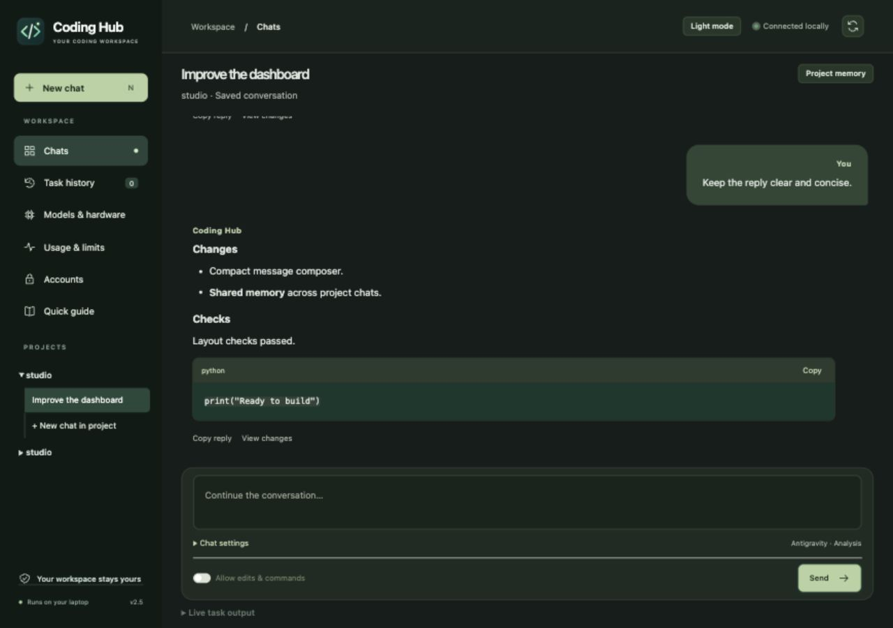
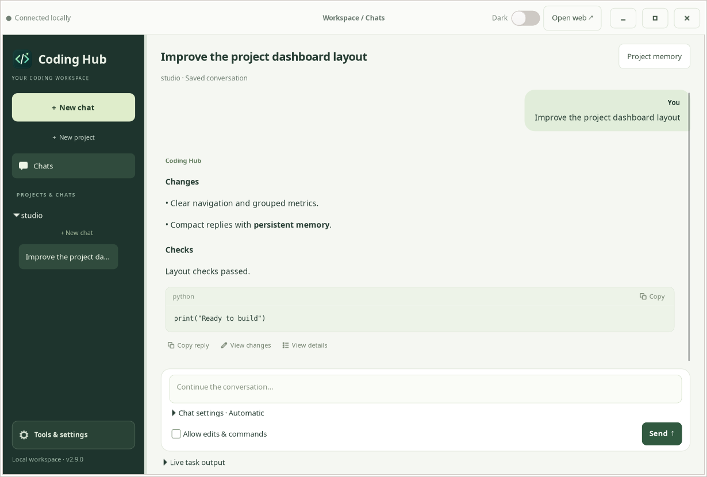
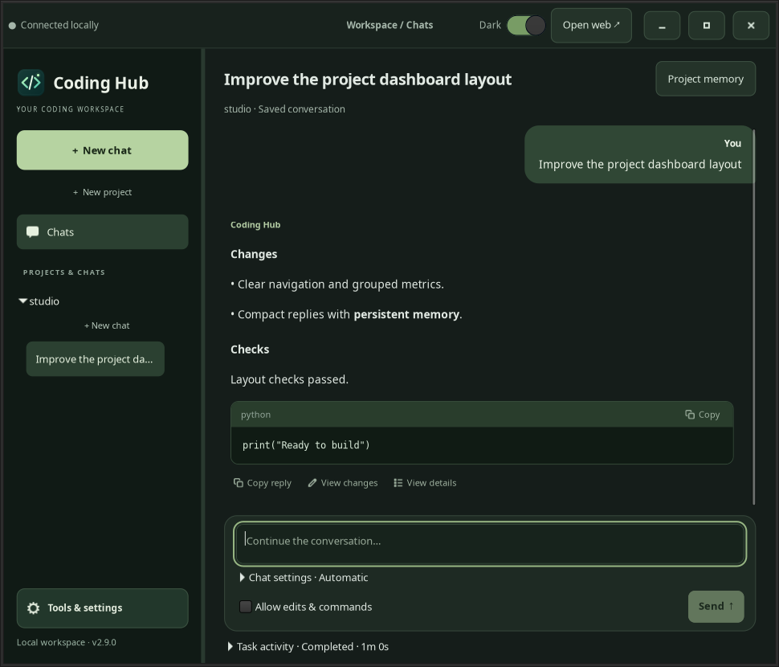
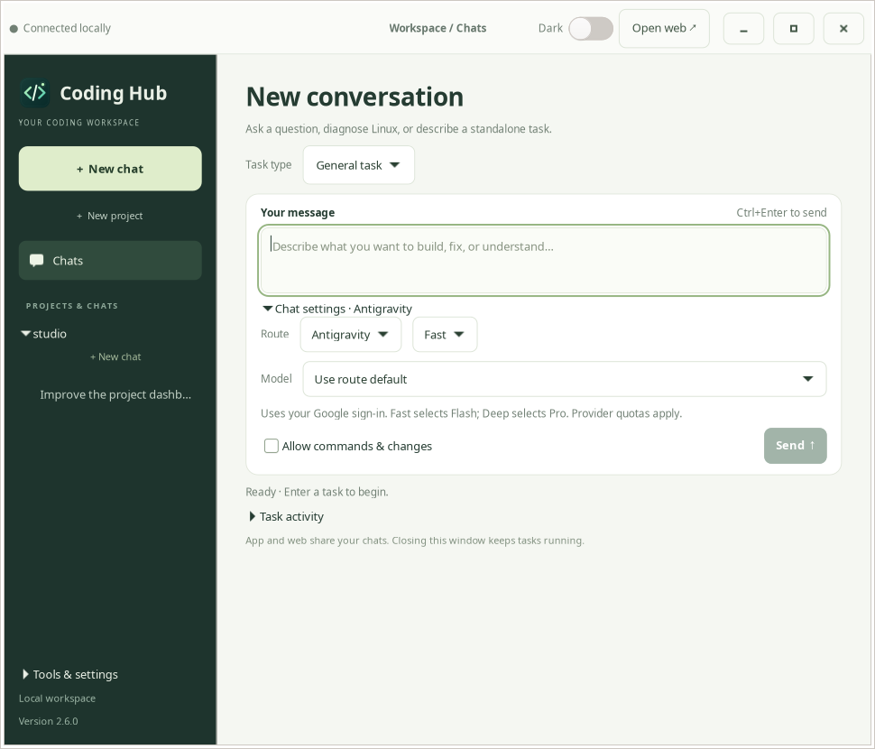
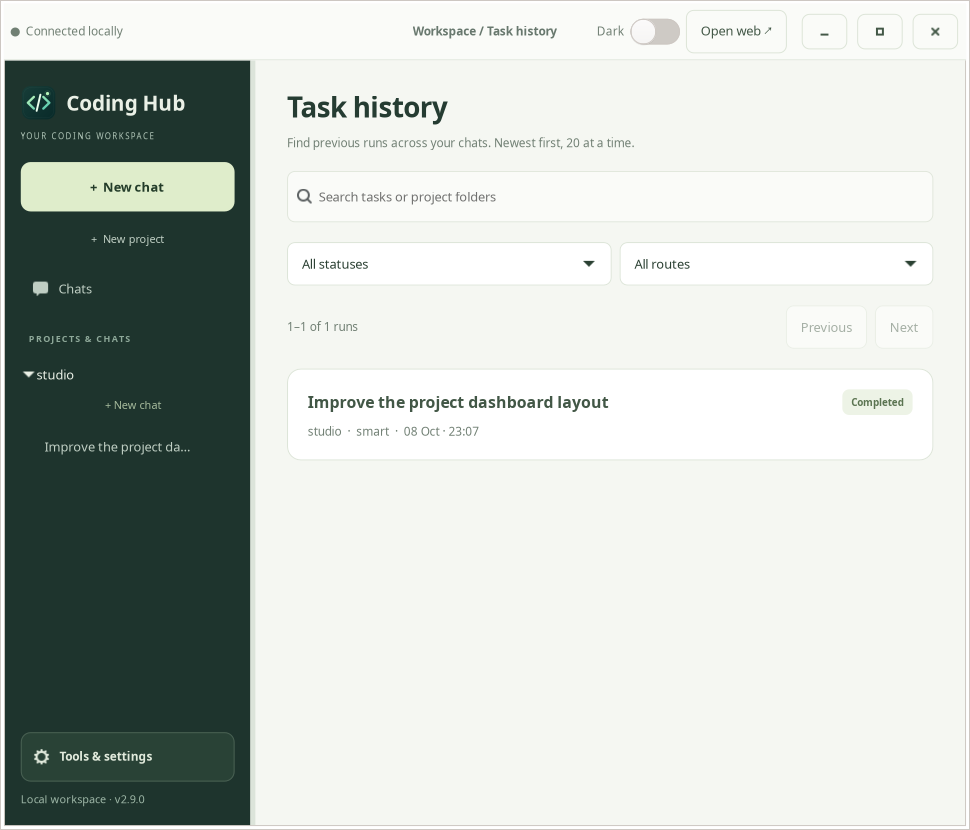
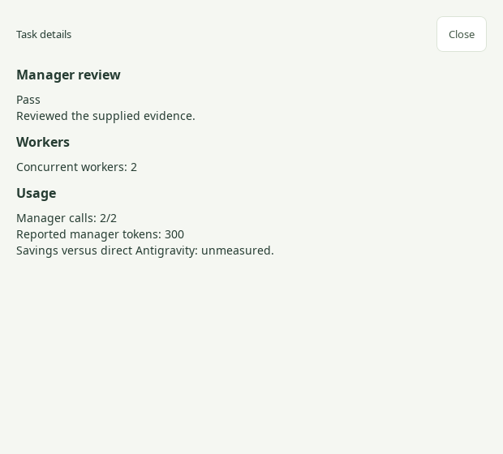
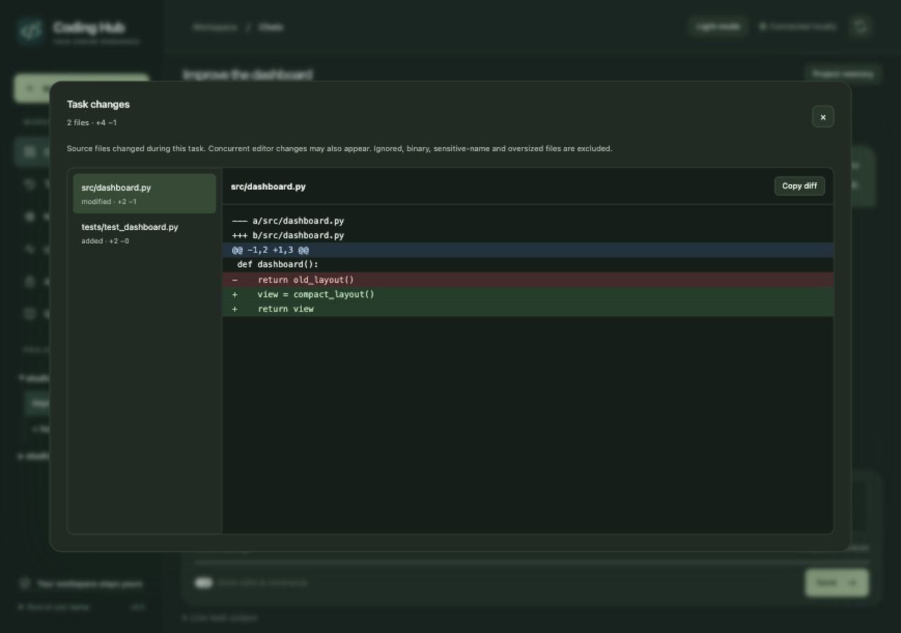

<p align="center"></p>
<h1 align="center">Coding Hub</h1>
<p align="center">A calm workspace for cloud coding agents and local Qwen.</p>

Coding Hub brings Antigravity, verified free OpenCode models, and Ollama into one workspace with **terminal, native Linux app, and web interfaces**. Use a **General task** for Linux help or standalone requests, or a **Project task** for work tied to a folder. Choose a project, describe a task, and follow its progress. Keep inference local when you want to, or use a cloud agent for larger work.



The native Linux app uses the same workspace organization, with dedicated pages for **Chats**, **Task history**, **Models & hardware**, **Usage & limits**, **Accounts**, and **Project memory**. Provider limits are grouped into cards, token breakdowns expand when needed, and project chats remain available in the sidebar. Existing chats hide the project picker, align your messages to the right and assistant replies to the left, and keep route settings in a compact disclosure. New chats let you choose General task or Project task. The sidebar starts at a compact 248 px; drag its divider to resize it, and the app remembers your width. The sidebar prioritizes chats, puts new conversations first, and keeps secondary pages in **Tools & settings**. The header’s Project memory button opens the shared instructions for the current project.



*Native GTK conversation preview with synthetic messages. Actual values come from your providers and local history.*



## What you get

- Project → chat navigation in the native app and browser, with saved messages, follow-up replies, earlier-message loading, live output, cancellation, and draft recovery.
- Persistent project instructions, pinned requirements, searchable conversation checkpoints, and a local source index for focused context.
- A Usage & limits page: live Antigravity quotas, free-model local usage and observed retry times, expected daily reset countdowns, and local Qwen status.
- Opt-in Smart routing: Antigravity makes a short plan and reviews evidence; verified free models or local Qwen perform the work, with measured manager token usage and at most two manager calls.
- Automatic fallback: Antigravity → currently verified free OpenCode models → local Qwen3 8B. A handoff preserves the original task and partial changes.
- NVIDIA status, actual model offload, memory usage, and a button to release the local model from memory.
- A lightweight Python backend and plain HTML/CSS/JavaScript, with no package installation or npm build required. Sign-in terminal rendering bundles unmodified `pyte` and `wcwidth`; source and licenses are in `vendor/`.
- A native Linux app window using GTK 4, with its own icon, plus a terminal menu and command-line interface.

## How to use the app, browser, and CLI

| Interface | Start | Use it for |
| --- | --- | --- |
| Linux app | Applications → Coding Hub, or `codehub app` | Daily project chats, sign-in, quotas, and hardware |
| Browser | `codehub web`, or **Open web** in the app | The same workspace in a browser |
| Terminal | `codehub`, `codehub chat`, or `codehub run` | Keyboard workflows and individual tasks |

### Linux app

1. Open **Coding Hub** from Applications. Pin that entry to your dock if desired. Its desktop ID and icon match the running GTK window.
2. Choose **New chat → General task** for questions, Linux commands, or standalone work—no folder required. Choose **Project task** or **New project** to select a project folder. Existing chats keep their original scope.
3. Expand **Chat settings**. Select a route and then a model. Antigravity lists models available to your Google account, including any Claude/GPT options. Free cloud shows currently verified free models; Local shows installed Ollama models. Smart lets you choose its Antigravity manager model and up to three cloud workers; Automatic selects its route models.
4. Leave **Allow edits & commands** off for explanations. Enable it to let the agent modify project files and run commands.
5. An animated indicator shows observed activity, such as planning, a tool action, waiting for the model, or review, with elapsed time. **Stop task** remains beside Send. Click **Send** or press **Ctrl+Enter** in the message box. Enter adds a line. **Ctrl+N** starts a new chat.
6. Replies format headings, lists, inline code, and code blocks. Replies span the reading area, with small copy/review actions beneath them and language labels on code blocks. The compact composer stays below the conversation. Sending moves to the newest message; scrolling up pauses following. **Latest messages** returns to the bottom.
7. Toggle **Dark** in the title bar to save your appearance preference. **Project memory** opens shared requirements for the current project.
8. The separate **Tools & settings** gear button at the bottom of the sidebar opens a compact menu. Choose **Models & hardware** for system information. **Run system check** collects read-only diagnostics; **Discuss in general chat** prepares a message for you to send. This page also shows CPU/GPU activity, RAM/VRAM, and loaded model placement. “GPU available” means the driver works; “GPU acceleration in use” means Ollama reports model data on the GPU. GPU activity includes other applications. Samples normally refresh every 3–6 seconds.

### Browser

Run `codehub web` on the machine hosting your models and use the page it opens. Its launch URL includes a temporary connection token. The app’s **Open web** button also opens an authenticated page.

Use the same **New chat**, **Chat settings**, **Accounts**, **Usage & limits**, and **Project memory** controls. Press **Ctrl+Enter** or **⌘+Enter** from the message box to send. Code blocks have a **Copy** button. **Dark mode** saves a browser-specific preference. The desktop web layout fills the available width and height, with a stationary reply composer.

App and web share chats and running tasks; drafts and theme preferences are separate. The server stays on loopback. For another computer, use an SSH tunnel rather than exposing it publicly. OAuth browser callbacks must reach the machine running the CLI; use a provider’s headless option when offered over a tunnel.

### Sign-in and accounts

Open **Accounts → Antigravity → Sign in / manage**. Use **Google OAuth** for personal access. Complete authentication on Google’s own page, return to the panel, and choose **Done / close** to refresh status. The first launch may ask you to trust the hub’s dedicated, empty account setup folder. Use **Reconnect Google** when you want to sign out of an expired session and authenticate again.

The panel supplies arrow, Enter, Tab, and Escape controls for native provider prompts, plus a masked field for a requested code or response. Temporary sign-in output is not saved to chat history. Credentials stay in the provider CLI’s own storage.

Optional separate subscriptions:

- **Claude:** install the [official Claude CLI](https://code.claude.com/docs/en/overview), then sign in from Accounts. Choose **Claude account** in Chat settings.
- **ChatGPT:** sign in through the installed [OpenCode provider flow](https://opencode.ai/docs/providers/#openai). Choose its ChatGPT subscription option, then **ChatGPT account** and a model in Chat settings. API-key billing is not enabled by this route.

These routes use your existing plan’s limits and model eligibility. They are never selected by Automatic or Smart and do not purchase a subscription. Separate Claude/ChatGPT quotas are not exposed by this integration; consult those providers’ own account interfaces. Antigravity’s included Claude/GPT quota remains visible under **Usage & limits**.

### CLI

```bash
codehub                              # Start chatting immediately
codehub menu                         # Optional launcher menu
codehub chat --general               # Standalone chat; no project folder
codehub chat --general --backend local
codehub run --general --apply "Run uname -s and df -h /, then summarize the output without changing anything"
codehub doctor                       # Read-only system diagnostics
codehub chat --project ~/my-project
codehub chat --project ~/my-project --backend local --model coding-hub-qwen:8b
codehub chat --project ~/my-project --continue
codehub models --backend antigravity  # Account model choices
codehub models --backend free         # Fresh zero-price check
codehub models --backend local        # Installed Ollama models
codehub run --project ~/my-project --backend free --model big-pickle "Explain the tests"
codehub run --project ~/my-project --apply "Fix the failing tests and run the relevant checks"
codehub login --provider antigravity
codehub login --provider claude
codehub login --provider openai
```

Inside `codehub chat`:

- `/help` shows grouped commands; Tab completes command names. Arrow keys edit the current input.
- `/paste` accepts a multiline message. Finish with a single `.` on its own line; `/cancel` discards it.
- `/models` lists choices; `/model MODEL_ID` selects one; `/model default` restores the default.
- `/workers 1`, `/workers 2`, or `/workers 3` sets the Smart maximum cloud workers for the same task. Local fallback remains one at a time. `/models` and `/model ID` on Smart select the Antigravity manager, including account-available Claude and Gemini models.
- `/route local`, `/route free`, `/route antigravity`, `/route claude`, or `/route openai` changes route. Automatic and Smart are supported too.
- `/project /path/to/folder` starts a project conversation; `/general` returns to standalone tasks.
- `/mode analysis` explains only; `/mode build` enables commands and requested changes.
- `/edit on` enables commands and requested changes; `/edit off` returns to analysis mode.
- `/doctor` prints a read-only system report and includes it in your next message. `/new` clears that pending report.
- `/changes` reviews the latest task diff; `/memory` shows shared instructions and source-index coverage; `/status` shows the current setup.
- `/delete` removes the current chat after you type `delete` to confirm. Enter cancels. Project files and shared memory stay intact.
- `/delete-project` removes the current project from Coding Hub after you type `remove project`. Enter cancels. The CLI then switches to a general chat; source files remain on disk.
- `/new` starts another conversation; `/quit` exits. Existing `:commands` still work.
- Ctrl+C cancels active work and preserves partial changes. At the input prompt, Ctrl+C exits the chat.

Interactive terminals show an animated progress line, readable replies, and labeled code blocks. Smart's internal planning/review JSON stays out of the final terminal conversation. Raw tool details remain in private logs. Redirected output stays plain text for scripts and the dashboard. `codehub open --backend local --project ~/my-project` opens the underlying agent’s full terminal interface.

### General tasks and Linux help

Use **New chat → General task** in the app/browser, or just run `codehub` in a terminal. `codehub chat --general` is equivalent. These chats are saved under **General chats**, separately from project conversations. Ask questions in analysis mode; enable **Allow commands & changes** (CLI: `/edit on` or `--apply`) when you want the agent to execute a task. For example: “Run `df -h /` and explain the disk usage without changing anything.”

**System check** runs a fixed set of read-only checks for disks, memory, CPU load, NVIDIA, time synchronization, failed services, and Secure Boot. It makes no model request and changes no settings. **Discuss in general chat** lets you review the report before sending it to your chosen model. Missing commands are shown as unavailable, not treated as evidence of a fault.

General tasks run with your normal user permissions. Administrator actions require you to run the proposed command yourself; the hub never collects a sudo password. Agents are asked to inspect first and perform only requested changes. Command mode is not an operating-system sandbox. Prefer focused requests and review the output.

Each general task starts in a private scratch folder at `~/.local/state/coding-hub/workspaces/general`; name an absolute destination when you want files somewhere else. Its chat history and memory persist across interfaces. Change review captures files inside that scratch folder only; system changes or files elsewhere must be verified through command output and direct inspection.




## Install

Requires Python 3.10 or later. Linux is the primary desktop target; the dashboard and terminal coordinator also run on macOS. Windows has a basic launcher, but full agent integration is not validated there.

The standalone Linux app additionally needs PyGObject and GTK 4. On Ubuntu 24.04 or later, if these are missing:

```bash
sudo apt install python3-gi gir1.2-gtk-4.0
```

Use the system `python3` so it can find these distribution packages. The CLI and web interfaces work without them.

Install the native agents you want to use:

1. [OpenCode](https://opencode.ai/docs/)
2. [Ollama](https://ollama.com/download)
3. [Antigravity CLI](https://antigravity.google/docs/cli/install/) for Google's native account access

```bash
git clone https://github.com/prabinadkri/coding-hub.git
cd coding-hub
python3 setup.py --local
```

Setup downloads Qwen3 8B (about 5.2 GB), creates the `coding-hub-qwen:8b` alias without duplicating its weights, and adds a Linux application launcher. Existing models are preserved. To install the launcher without downloading a model, run `python3 setup.py`.

Open **Accounts** in the app or browser to complete your Google sign-in. The coordinator calls the native CLI; it does not extract or proxy account tokens. See the interface guide above for separate Claude/ChatGPT accounts.

## Use

Choose the interface you prefer:

```bash
codehub       # Terminal menu
codehub app   # Standalone Linux application
codehub web   # Dashboard in your browser
```

If `codehub` is not on your PATH, use `~/.local/bin/codehub` instead. On Linux, **Coding Hub** in the Applications menu and `Coding Hub.sh` open the standalone app. The app icon's context menu also offers the browser and terminal. On macOS, `Coding Hub.command` opens the browser interface.

Choose a project folder and enter your task. Analysis mode is the default. Enable **Allow edits & commands** for implementation. **Fast** selects Flash for Antigravity; **Deep** selects Pro. Expand **Chat settings** to choose a specific model for Antigravity, Free cloud, or Local. Explicit free-model choices still require fresh zero-price verification before execution.

The app and browser share one background server and task history; reopening the app raises its existing window. The terminal uses the same routing engine, models, project memory, and saved conversations. CLI chats appear under their project in the app and browser; native CLI run logs remain separate from dashboard task activity.

The server listens only on `127.0.0.1`, and its APIs require a per-session token. The launch URL places that token in the fragment, then the app removes it from the address bar. Tasks keep running when the app window or browser tab closes. The standalone app starts the server in the background when needed. When you start a fresh server with `codehub web`, keep that terminal open until tasks finish. The app’s **Open web** button opens the browser interface.

The terminal interface remains available:

```bash
codehub
codehub status
codehub chat --project ~/my-project
codehub chat --backend local --project ~/my-project --continue
codehub run --project ~/my-project "Explain this project"
codehub run --project ~/my-project --apply "Fix the failing tests"
codehub run --backend local --project ~/my-project --apply "Add input validation"
codehub open --backend local --project ~/my-project
codehub open --backend free --project ~/my-project
```

In the dashboard, **N** starts a new chat, and **Ctrl/Cmd + Enter** runs it. Native interactive agents keep their normal edit and command confirmation prompts.

## Smart manager and workers

Choose **Smart** in the app or browser, or run:

```bash
codehub chat --backend smart --project ~/my-project --apply
codehub run --backend smart --model claude-sonnet-4-6 --workers 2 --project ~/my-project --apply "Build the frontend and backend for this system"
```

Choose **Smart → Manager model** in Chat settings, or use `/model MODEL_ID` / `--model MODEL_ID` in the CLI. Choices come from your Antigravity account's current model catalog, including its available Claude, Gemini, and other models. A selected model is used for both planning and review; it never silently switches to a worker model. With **Use route default**, Fast uses Flash and Deep uses Pro. Separate Claude/ChatGPT subscriptions remain direct routes.

Choose **Cloud workers: 1, 2, or 3**. This is one request in one chat: for example, the manager can assign frontend files to one worker and backend files to another, with a shared API contract. Workers use distinct currently verified free models. Each receives a private copy of eligible project source, including uncommitted files. Their allowed file lists must be disjoint. After they finish, Coding Hub checks file ownership and checks that the originals have not changed, combines the edits, and runs a free/local integration worker to check interfaces, run tests, and fix integration issues. The manager then reviews bounded reports and observed evidence. The normal **View changes** action shows the final changes in your project.

The count is a maximum, not a demand to split every task. General/system tasks and analysis stay sequential. Unsafe/overlapping plans, insufficient free models, linked source, or copies exceeding 20,000 files / 128 MiB fall back to one worker. Dependencies, secrets, dotfiles, and generated folders are not copied. Worker copies are a conflict-prevention mechanism, not an OS security sandbox. Failed or conflicting assignments remain in the private task folder for inspection without being integrated; successful copies are removed. Free cloud failures can fall back to local Ollama, with only one local worker running at a time within the task. Provider quotas still apply; more workers are not unlimited free capacity. Stop cancels the worker processes as well as later stages.

Each task has a limit of two manager invocations, an 18,000-byte supplied prompt limit per invocation (including its response schema), bounded combined evidence that does not grow with worker count, and a two-minute timeout per invocation. Short sequential analysis requests skip planning. Manager calls use a tool-free custom agent in a separate private directory to avoid automatic project discovery. Responses are schema-validated. The provider CLI adds its own prompt and reasoning overhead and exposes no hard total-token limit; the byte limit is not a token cap. Requests are limited to 6,000 UTF-8 bytes.

A rejected review stops with **Needs review**, preserves the worker's changes, and gives next steps. No recursive manager repair loop or automatic direct-Antigravity implementation is started. Provider failure and unavailable reviews remain incomplete. Stop cancels further work.

The result shows the provider-reported manager token total; the full breakdown is saved privately in the task's `smart.json`. Missing usage is shown as unavailable. Direct Antigravity is not run again merely to measure a baseline. **Lower token usage and equal quality cannot be guaranteed for every task.** Two native manager calls can cost more than a quick direct answer. Smart is intended for focused implementation where workers can handle most exploration and coding. Its review sees partial evidence, not the complete repository or an independent execution of every test. Review the actual changes and validation output.

In one paired checkout-validation test, Smart used **8,171 reported Antigravity tokens** versus **122,733** for direct Antigravity, about **93.3% less**. Both passed the same eight independent acceptance checks. This small example is not a general quality or savings guarantee; worker tokens are excluded from this Antigravity-only comparison. See [the benchmark details](docs/smart-benchmark.md).

A second frontend/backend check with Sonnet and two parallel workers used **10,316 reported manager tokens** versus **15,587** for direct Sonnet (**33.8% less**); both passed nine independent checks. This development run exposed response-length validation issues, now covered by regression tests. The benchmark notes disclose the reused plan, revalidated review, discarded attempt, and separately reported cache reads.

## Delete a chat

In the app or browser, hover over a chat in the sidebar (or focus it with the keyboard) and click the small trash icon, then choose **Delete chat**. **Cancel** keeps it. In the terminal, use `/delete` in the current conversation and type `delete` to confirm.

Deletion removes that chat’s saved messages, searchable conversation history, checkpoints, task activity, logs, and change previews from Coding Hub’s local state. It cannot be undone. Project files (including any changes made during the chat), shared pinned requirements, instruction files, the source index, and other chats are kept. Provider-side sessions and usage records are managed separately by their providers. Wait for any active task in that workspace to finish before deleting a chat.

Deleting the open chat takes you to a fresh chat. The app and browser refresh their shared history automatically; a terminal whose chat was deleted elsewhere must use `/new` before sending another task.

## Remove a project

Hover over a project heading in the app or browser sidebar, or reach it with keyboard focus, and choose its small trash icon. Confirm **Remove project** to remove all of that project's saved chats, task logs, change previews, checkpoints, source index, and pinned Coding Hub memory. **Cancel** leaves everything intact. The project folder, source files, Git history, and instruction files such as `CODING_HUB.md` and `CLAUDE.md` are never deleted. This only affects local Coding Hub records; provider-side sessions and usage records are separate.

Removal is blocked while a task in that project is queued, running, or stopping. Removing the open project returns the app/browser to a new general chat and clears its saved selection. Other projects and General chats are preserved. You can choose the same folder and start a new chat to add it again; its deleted history and pinned notes cannot be restored. A small local removal marker prevents stale windows from re-adding it automatically. General chats have individual chat deletion, rather than a project removal action.

## Project instructions and long conversations

Use **Project memory** in the app or browser to pin requirements that should apply to every task. Pinned text is kept verbatim, up to 4,000 UTF-8 bytes. It is saved privately outside the project. To create an editable instruction file inside a repository:

```bash
codehub init --project ~/my-project
```

This creates `CODING_HUB.md` with sections for architecture, development commands, constraints, and working practices. It refuses to replace an existing file. Existing root `AGENTS.md`, `CLAUDE.md`, and `GEMINI.md` files are also respected and never overwritten. Up to 5,000 bytes of project-file guidance are included directly; larger files are identified for the agent to read as needed. Keep instructions concise and specific.

Each chat stores its original goal, user messages, assistant results, completion state, and immutable per-turn checkpoints. A follow-up retrieves the latest turns and relevant earlier discussion. The app and browser group chats under their project, and can load earlier messages on demand. The CLI offers the same continuity:

```bash
codehub run --project ~/my-project "Explain the checkout flow"
codehub run --project ~/my-project --continue "Now add validation for negative amounts"
codehub chat --project ~/my-project --continue
codehub memory --project ~/my-project
codehub memory --project ~/my-project --pin "Preserve public API names. Use pytest."
```

Inside `codehub chat`, use `:new`, `:memory`, or `:quit`. Edit permissions are explicit for each run; use `--apply` when implementation is intended.

## Large repositories and focused context

Before a task, a local SQLite FTS5 index scans eligible source files and updates changed files. Retrieval ranks matching paths and code chunks, then includes a small selection with file and line references. It uses lexical search and needs no embedding service or additional model.

- Git repositories respect Git's ignore rules. Dependencies, generated directories, common secret filenames, binary files, and symlink targets are excluded.
- Individual indexed files are limited to 256 KiB. Normal updates have a 12-second work budget and a 128 MiB read budget; unfinished scans continue across runs, prioritizing unindexed files.
- The added memory/retrieval packet is capped at 12,500 UTF-8 bytes. The current request, native agent prompt, and tool schemas use additional context.
- OpenCode automatic compaction and pruning remain enabled, with 6,144 tokens reserved. The agent is prompted to search first, read focused ranges, work in small testable steps, and report decisions and next steps.

For a large first scan, prepare the index ahead of time:

```bash
codehub index --project ~/my-project --seconds 120
```

A synthetic validation indexed 10,000 small source files in about 4.7 seconds on one development machine and selected 656 bytes for a targeted symbol query. A live local Qwen test found a function in a separate 1,000-file demo and correctly recalled a project requirement on the next turn. These are focused checks, not a guarantee for arbitrary codebases. Large files, broad architectural changes, ambiguous queries, and difficult reasoning can still require manual direction or a stronger cloud model.

## Antigravity quota

The browser quota card and the native app's **Usage & limits** page show remaining percentages, provider reset times, countdowns, and the last successful check. You can refresh manually or use:

```bash
codehub quota                      # All providers
codehub quota --provider antigravity
codehub quota --provider free      # Local read only; no model requests
codehub quota --provider local
```

The hub invokes `agy -p /usage --output-format json`. This is Antigravity's own slash command, which returned structured quota groups with zero model turns in validation. It does not extract tokens or call private account APIs. Background checks are limited to once every five minutes. Failed refreshes retain the last known snapshot with a stale/error label; missing reset times stay unknown. Percentages apply to the provider's shared model groups. See [official quota documentation](https://www.antigravity.google/docs/cli/commands/usage).

## Free-model usage and reset times


Open **Usage & limits** in the browser sidebar or **Usage & limits** in the native app. Space Bunny, LongCat 2.5 Preview, and Big Pickle each show today's locally observed AI responses and tokens, with input, output, reasoning, and cache details. The same data is available with `codehub quota --provider free`.

**Remaining allowance is shown as “Not reported.”** The current free-model integration has no public remaining-quota endpoint. Counts read from OpenCode's local database are not the provider's request counter: retries, traffic from other devices, and shared public-IP usage may be missing. A free model is not an unlimited model.

The [published OpenCode free limiter](https://github.com/anomalyco/opencode/blob/5d9cd9b259f0456522f318a7435501d03cfbee79/packages/console/app/src/routes/zen/util/ipRateLimiter.ts) uses UTC-day buckets and can share limits across models on the same public IP. The hub shows an **expected** daily reset at 00:00 UTC (05:45 in Nepal), converted to your device's time zone. This is source-based timing, not a live guarantee or a promise of restored availability; production rules can change. No undocumented “200 requests” allowance is assumed.

When OpenCode records an HTTP 429 error with `Retry-After`, the model card displays that provider-reported retry time and the observation time. Expired retry windows say access has not been rechecked. A later successful response clears the old limit observation. An error without a retry time stays unknown. These observations do not trigger quota probes, network changes, or bypasses.

Usage refreshes read the local SQLite database in read-only mode, at most once every 20 seconds automatically, with a manual refresh button. No prompts or account tokens are sent anywhere. Queries retrieve model usage/error metadata, not conversation text or source content. Raw error bodies and headers are never returned to the interface. Missing, busy, or unsupported databases show unavailable usage rather than zero. Daily counts use recorded UTC dates; records ahead of the current clock are labeled. Refresh timers tolerate system-clock corrections. Local Qwen shows no provider quota or reset requirement; hardware and context limits still apply.

The default database is `$XDG_DATA_HOME/opencode/opencode.db`, or `~/.local/share/opencode/opencode.db`. For a custom OpenCode installation, set `CODING_HUB_OPENCODE_DB` to its database path. See the [official OpenCode CLI usage commands](https://opencode.ai/docs/cli/#stats).

## Performance and limits

Qwen3 8B uses Q4_K_M weights, 16K context, a 2,048-token output limit, and explicit thinking-off requests for focused tasks. Local title and summary generation are disabled. The NVIDIA driver must be active for GPU offload. A 4 GB GPU cannot hold the full model; mixed CPU/GPU execution is expected.

The 16K setting is a hardware compromise, below [Ollama's documented 64K+ OpenCode requirement](https://docs.ollama.com/integrations/opencode). Small tasks work in testing; individual requests and tool results can still exceed the limit even with retrieval and checkpoints. Prefer cloud agents for complex work. See [GPU setup](docs/gpu-setup.md) for driver troubleshooting.

Automatic routing starts Antigravity immediately. Free-model pricing is fetched only if that route is reached. Dashboard status uses a short cache; it never authorizes a paid request from cached pricing. There is one active dashboard task at a time, and the coordinator also locks each workspace. Process-lifetime locks release when the owner exits; abandoned lock files from older versions are recovered automatically. A genuinely active task remains protected from concurrent changes.

## Free access and privacy

The free route allowlists Space Bunny, LongCat, and Big Pickle, requires tool support and all recorded token costs to be zero in [models.dev](https://models.dev), and pins the primary and helper models. If current pricing cannot be checked, that route is skipped. Catalogs can lag provider changes, so this is not a billing guarantee. Keep accounts on free access and do not add payment details or select paid models manually. Provider quotas and promotions can change.

Setup sets Antigravity's `useG1Credits` preference to false and backs up existing settings once. No credit purchases are made. [OpenCode's free Big Pickle terms](https://opencode.ai/docs/zen/) say free-period data may be used to improve the model.

Cloud routes send task content and relevant files to their provider. Local inference uses Ollama on this machine. Coding commands can still access the internet, such as to install project dependencies. Edit mode permits shell execution and is not an operating-system sandbox. Review changes and actual test results; a completed agent response does not guarantee correct code.

Private task records, source search indexes, pinned requirements, conversation checkpoints, quota snapshots, logs, pricing metadata, and dashboard session details are stored in `~/.local/state/coding-hub`, outside the source tree. Do not publish that directory. The repository contains no model weights, account credentials, task transcripts, or machine-specific connection settings.

## Development

```bash
python3 -m unittest discover -p 'test_*.py' -v
python3 hub.py web
```

The tests cover free-price rejection, fallback and cancellation, literal subprocess arguments, dashboard authentication, project isolation, incremental retrieval, bounded long-conversation context, instruction-file preservation, quota parsing, free-model usage isolation and retry-time handling, chat history, isolated parallel assignments and integration conflicts, serialized local fallback and cancellation, Smart model selection and call limits and review failures, and real background-server lifecycle. CI runs the suite on Linux and macOS. A separate native UI check builds the real GTK widgets with synthetic data, renders all six pages and existing conversations at two window widths, plus dark-mode previews. It checks chat deletion and cancellation, Ctrl+Enter, scroll following, reading-position preservation, compact composer size, model selection, temporary sign-in controls, theme persistence, message alignment, project-picker visibility, conversation navigation, task history, memory isolation, and refresh behavior without sending model prompts.

To run that Linux UI check (requires GTK 4, PyGObject, Xvfb, and a session bus):

```bash
xvfb-run -a dbus-run-session -- python3 tools/check_desktop_ui.py --output /tmp/coding-hub-ui
```

These renderings use an isolated temporary state directory and do not read your saved chats or provider credentials.

Licensed under [MIT](LICENSE).

### Finding previous runs

Open **Tools & settings → Task history** when you need a run across chats. Search by task text or project folder, filter by status or route, and use **Previous / Next** to browse 20 runs per page, newest first. This includes archived runs beyond the recent activity list. Opening a result returns to its chat and task output. History is loaded on demand from local metadata, without loading every log or calling a model.



### Reviewing replies and file changes

Replies use readable Markdown, code blocks, and a **Copy reply** button. The browser also offers **Copy** on each code block. Detailed tool output stays under **Task activity**. Smart replies show the main answer by default; the small **View details** action reveals the manager review, worker attempts, and reported token usage. Older saved Smart replies use the same presentation. Findings that need your attention remain in the main answer. In terminal chat, use `/details` for the latest reply’s Smart details. Opening details uses no model tokens.



After a new task with **Enable edits** finishes, choose **View changes** under its reply. Select a file to see green added lines, red removed lines, and line numbers in the diff headers. These are before/after snapshots of that task, so earlier edits are not presented as new work. Concurrent edits from another editor can still appear. This viewer is read-only; it does not commit or undo files.

In terminal chat, type `:changes`. Outside chat, run `codehub changes --project /path/to/project`, optionally adding `--task TASK_ID`. The command defaults to the latest saved task. Historical tasks and analysis-only tasks have no change snapshot.

Snapshots cover eligible source files, exclude ignored/sensitive-name/binary files and symlinks, and use bounded scans (5 seconds, 32 MB, 256 KB per file). Reviews show up to 64 files / 200 KB of diffs. Partial coverage is labeled. Reviews and chat history stay in private application state, outside the project; this is not a backup of every file.



### Provider access troubleshooting

A model's **Price verified** status means its published price is zero; it does not guarantee service access. If OpenCode's free service returns “free tier can only be used from within OpenCode” even from the official CLI, choose Antigravity or Local. Related upstream reports include [an official CLI free-tier rejection](https://github.com/anomalyco/opencode/issues/52907). Coding Hub keeps analysis-mode permissions restricted and does not bypass provider access controls.

If Claude reports an expired OAuth session, open **Accounts → Claude → Sign in** and reconnect. “Sign-in saved” only indicates saved sign-in metadata; the provider confirms validity when used. ChatGPT requires an explicit model selection after subscription sign-in.

The native **Open web** action uses the Linux desktop’s browser launcher and reports launch errors. Snap and Flatpak browser registrations are recognized even when the app was started over SSH. If no browser is configured, choose one in Linux **Settings → Default Apps**.
